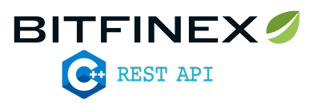

***

### Build status

| [Linux][lin-link] |
| :---------------: |
| ![lin-badge]      |

[lin-badge]: https://circleci.com/gh/MMquant/bfx-cpp-api/tree/master.svg?style=svg "CircleCI build status"
[lin-link]:  https://circleci.com/gh/MMquant/bfx-cpp-api "CircleCI build status"

### Notice

***Master*** branch contains new version of the client. For old version checkout ***legacy*** branch.

### Synopsis

This header-only library contains class for interfacing Bitfinex REST API v1. Current version supports response JSON
schema validation.

### Dependencies

*bfx-cpp-api* depends on following external libraries/packages

* *cmake* - [https://cmake.org/download/](https://cmake.org/download/)
* *libcrypto++* - [https://www.cryptopp.com/](https://www.cryptopp.com/)
* *libcrypto++-dev* - [https://www.cryptopp.com/](https://www.cryptopp.com/)
* *curl* - [https://curl.haxx.se/download.html](https://curl.haxx.se/download.html)
* *libcurl4-gnutls-dev* or *libcurl4-openssl-dev* - [https://curl.haxx.se/download.html](https://curl.haxx.se/download.html)
* *gcc* > 7.2 or C++14 compatible *clang*

### How to Build'n'Run `src/example.cpp`

1. Install dependencies (via apt, homebrew etc.).
2. Clone or download *bfx-api-cpp* repository.
3. Add `key-secret` file in `bfx-api-cpp/app/doc` directory. (or edit `example.cpp` so that it doesn't use `key-secret` file)
4. Peek into self-documented `<your_project_dir>/app/src/example.cpp`.
5. Build `example` binary

```BASH
cd <your_project_dir>app/build && cmake .. && make
```

7. Run `example` binary from `<your_project_dir>app/bin`

```BASH
./example
```

### How to Build'n'Run `src/example.cpp` in Docker container

1. Clone or download *bfx-api-cpp* repository.
2. Build docker image

```BASH
cd <your_project_dir>
docker-compose build
```

3. Start docker image

```BASH
docker-compose up &
```

4. Spawn bash

```BASH
docker exec -it bfx-cpp-api_dev_1 /bin/sh
```

5. Add `key-secret` file in `/home/bfx-cpp-api/app/doc` directory. (or edit `example.cpp` so that it doesn't use `key-secret` file)

```BASH
cd /home/bfx-cpp-api/app/doc
echo <key> > key-secret
echo <secret> >> key-secret
```

6. Build example

```BASH
cd /home/bfx-cpp-api/app/build
cmake ..
make
```

7. Run `example` binary

```BASH
cd /home/bfx-cpp-api/app/bin
./example
```

### Quick interface overview

```C++
// Create API client for both authenticated and unauthenticated requests
BfxAPI::BitfinexAPI bfxAPI("accessKey", "secretKey");

// Create API client for just unauthenticated requests
BfxAPI::BitfinexAPI bfxAPI();

// Fetch data
bfxAPI.getTicker("btcusd");

// Check for errors
if (!bfxAPI.hasApiError())
{
    // Get response in string
    cout << bfxAPI.strResponse() << endl;
}
else
{
    // Inspect errors
    cout << bfxAPI.getBfxApiStatusCode() << endl;
    cout << bfxAPI.getCurlStatusCode() << endl;
}
```

See self-explanatory `src/example.cpp` for general usage and more requests.

### Change Log

- 2018-09-26 Using the small Docker image Alpine instead of Debian.
- 2018-09-26 Using docker-compose to build/up/down the image.
- 2018-09-26 Grouping project files inside the app folder.
- 2018-08-01 Dockerfile added. CircleCI added.
- 2018-07-24 CMakeLists.txt added. Installation instructions changed.
- 2018-07-11 Schema validation logic complete. Client currently validates public requests only.

### Known issues

You will not be able to compile *bfx-cpp-api* with GCC<7.2 due to this [bug](https://gcc.gnu.org/bugzilla/show_bug.cgi?id=66297).
You can use CLANG to avoid GCC bug.

### Contribution

1. Fork `bfx-cpp-api` repository.
2. Commit to your ***develop*** branch.
3. Create pull request from your ***develop*** branch to ***origin/develop*** branch.

No direct pull request to ***master*** branch accepted!

### Author

Petr Javorik [www.mmquant.net](www.mmquant.net) [maple@mmquant.net](maple@mmquant.net)
